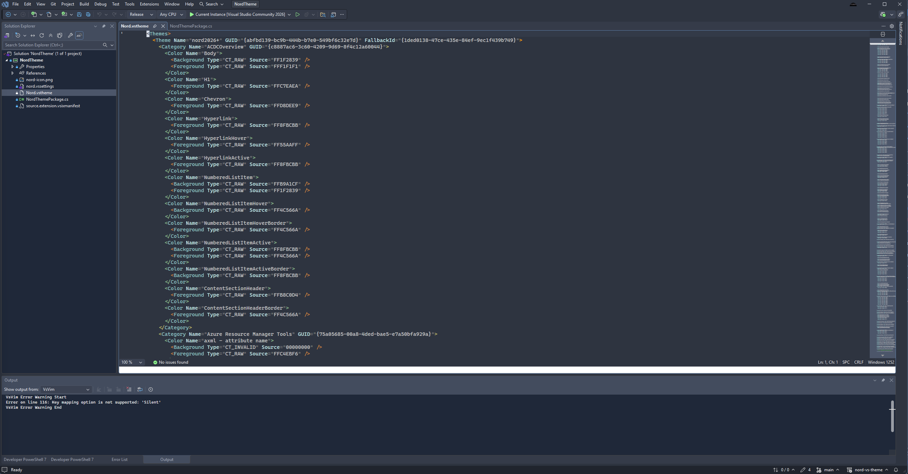

<h1 align="center" style="text-align: center">
nord2026+
</h1>

## Summary

A [Nord](https://www.nordtheme.com/) dark theme for **Visual Studio 2026+**, with VS 2026 semantic token support. Color mappings are aligned with the official [Nord for Visual Studio Code](https://github.com/nordtheme/visual-studio-code) extension.

This project is a rewrite of [jwendl/nord-vs-theme](https://github.com/jwendl/nord-vs-theme), modernized for Visual Studio 2026 with the help of an AI assistant (Claude).

## Installation

### From VSIX

1. Download the latest `NordTheme.vsix` from [Releases](https://github.com/xarthurx/nord_vs2026plus/releases)
2. Double-click the `.vsix` file to install
3. Restart Visual Studio
4. Go to **Tools > Options > Environment > General > Color theme** and select **nord2026+**

### From Source

1. Clone the repository
2. Open `src.2026/NordTheme.slnx` in Visual Studio 2026
3. Build the solution in Release configuration
4. The `.vsix` file will be in `src.2026/NordTheme/bin/Release/`
5. Double-click the `.vsix` to install

## Credits

- Original Visual Studio theme by [Justin Wendlandt](https://github.com/jwendl/nord-vs-theme)
- [Nord](https://www.nordtheme.com/) color palette by [Sven Greb](https://github.com/svengreb)
- VS 2026 modernization and semantic token support done with AI assistance ([Claude](https://claude.ai))

## License

MIT
